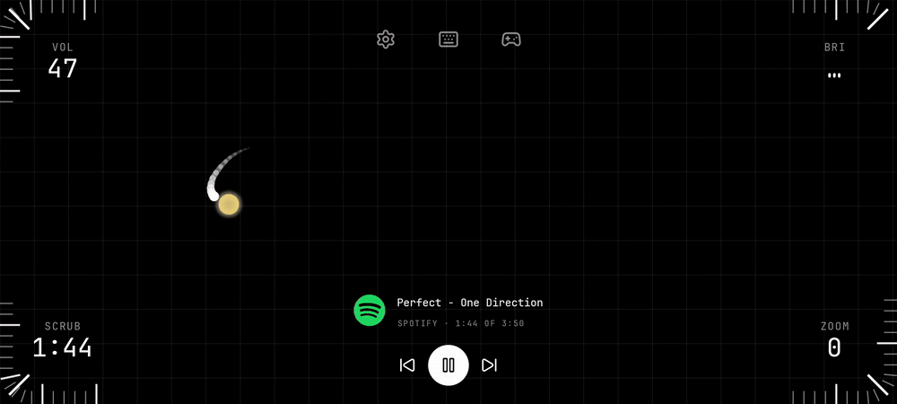

<p align="center"><picture><source media="(prefers-color-scheme: dark)" srcset="assets/edgepad-dark.svg"></picture></p>

# Edgepad

Edgepad turns an Android phone into a trackpad, a media remote and a control panel for a Windows laptop, over a direct Bluetooth link with nothing in between.

<p align="center"></p>

<p align="center"><sub>The phone's screen. The finger crosses the trackpad, then slides the corner ruler and the volume follows.</sub></p>

It is for the times the laptop is across the room rather than under your hands: plugged into a television, docked on a desk you are not sitting at, parked somewhere a mouse dongle will not reach. The alternatives are a remote app that only sends media keys, or a remote-desktop app that streams the whole screen and wants an account and a network round trip to change the volume. Edgepad is neither. The phone and the laptop pair once, the way a headset does, and after that they talk directly: no account, no Wi-Fi, no service in between that can be slow or down. The cost is Bluetooth's own — both ends need it, and it does not reach another room or the internet.

[](https://github.com/akshit-bansal11/edgepad/actions/workflows/ci.yml)
[](https://github.com/akshit-bansal11/edgepad/releases/latest)
[](LICENSE)
[](https://edgepad-docs.vercel.app)

## What it does

- **Corner rulers.** Each corner of the phone holds a dial drawn as a ruler that wraps the bend. Slide along it, clockwise to raise. Volume, brightness, media scrub, zoom, app switcher or microphone level; Settings picks what each corner does, how long the rulers are and how tall.
- **Trackpad.** Everything between the corners moves the laptop's pointer. One finger moves and clicks, two scroll and pinch, three and four fingers do whatever you assign them: desktops, task view, media, volume, app switcher, and more. Press one finger and hold it still until it ticks, then draw without lifting: a shape you have drawn in Settings runs a laptop action, a macro, or hides or locks the pad itself. A stroke that matches nothing does nothing.
- **Media.** The track, the app playing it and where it is, with previous, play/pause and next. Drag the three pieces anywhere on the surface.
- **Keyboard and gamepad.** A full on-screen keyboard whose modifiers work held or tapped, and a gamepad that drives a real virtual Xbox controller on the laptop, sticks and triggers analog, where the [ViGEmBus](#install) driver is installed; where it is not, the same pad falls back to pressing keys and says so. Every control is yours to add, bind, label, size, move or delete, and layouts are a library rather than one arrangement, so a phone can keep one per game. Both open sideways.
- **Live state.** The dials show the laptop's real volume, mute, brightness and playback position, and follow changes made on the laptop itself.
- **Guide.** Five pages on the first run, and again from Settings, one at a time or on one page.
- Black on white or white on black, and upright or sideways: both are toggles in Settings. The orientation holds the control surface and the media-layout editor, and nothing else — a media layout is stored per orientation, so a phone turned mid-edit would quietly start changing the other one. The keyboard and the gamepad are always sideways; every other screen follows the phone.

## Install

Both apps come from the [latest release](https://github.com/akshit-bansal11/edgepad/releases/latest). Always install both from the same release: the two refuse each other at the handshake when their protocol versions differ, and say so. 3.0.0 moved the protocol from version 3 to version 4, so a 2.x app on either side will not talk to a 3.x one — update both halves together or neither connects.

### Laptop (Windows 10 version 2004 or later, 64-bit)

1. Download `Edgepad.exe`. It is a single self-contained file; nothing else needs installing.
2. Run it. It is not code-signed, so SmartScreen asks first: choose **More info**, then **Run anyway**.
3. It lives in the system tray. The menu shows the version, whether a phone is connected, **Macros…**, **Start with Windows**, **Forget trusted phone**, **Open log**, **Documentation** and **Quit**.

Running a newer `Edgepad.exe` asks the running copy to quit and takes its place.

**Optional, for the gamepad: ViGEmBus.** The gamepad works without it — every control can be bound to a keyboard key, and keys are what the pad sends on a laptop with no controller driver, which is the state most laptops are in. Install [ViGEmBus](https://github.com/nefarius/ViGEmBus/releases/latest) and Edgepad plugs a virtual Xbox controller into Windows instead, so the sticks and triggers carry their full analog range and a game that only ever accepted a controller can be played from the phone. It is a third-party kernel driver, signed as Windows requires of one, and you install it yourself; Edgepad neither bundles nor installs it. You never have to guess which of the two you are in: the laptop answers every request for the controller, and the gamepad screen says **keyboard mode** and which of the three reasons it was, rather than being quietly dead.

### Phone (Android 12 or later)

1. Download `Edgepad.apk` and open it. Allow installing from this source if asked.
2. On first run, allow the **Nearby devices** permission. Edgepad uses it to see the laptops paired with the phone; it never scans for new ones.
3. Every later release installs over the previous one; settings are kept.

## Use

1. Pair the phone with the laptop once, in Windows **Settings > Bluetooth & devices**.
2. Keep Edgepad running in the laptop's tray.
3. Open Edgepad on the phone and tap the laptop. The first phone to connect becomes the laptop's trusted phone; any other paired phone is refused until you choose **Forget trusted phone** in the tray menu.
4. The phone remembers the laptop and reconnects when the app opens. If the link drops, the phone retries ten times, two seconds apart, and says so.

### The control surface

| Where | Touch | Laptop does |
| --- | --- | --- |
| A corner ruler | slide | turns that dial: clockwise raises |
| A corner ruler | tap | the dial's action: mute, play/pause, mic mute, task view, reset zoom |
| Anywhere else, one finger | move / tap / tap then hold-and-move | pointer / left click / drag |
| Anywhere else, one finger | press, hold still until it ticks, then draw | what that shape is bound to: an action, a macro, or the pad's own focus or lock |
| Two fingers | drag | scroll both axes |
| Two fingers | pinch / tap | zoom / right click, or what Settings assigns |
| Three or four fingers | tap, swipe up, down, left, right | what Settings assigns |
| Top centre | tap one of the five buttons | Settings, the keyboard, the lock, the gamepad, the macro grid |
| Back | | leaves the surface; the link stays up |

Out of the box, three fingers left and right switch desktops, three up opens task view, three down shows the desktop, four fingers left and right walk the app switcher (Alt stays held while the fingers are down), and tapping searches or opens notifications. Every one of those is changed under **Settings > Trackpad**.

The lock in the middle of that row is the one button that changes the surface instead of opening a screen. One tap hides the dials and the media and leaves the trackpad; a second tap straight after locks the trackpad instead and puts the dials and the media back, so the phone can sit in a pocket or under a palm and answer only its rulers. Any later tap returns the whole surface. The mode is not stored: a phone that came back up silently locked would read as broken.

### Settings

- **Connection:** the remembered laptop with its round trip, Forget, and whether to reconnect automatically.
- **Surface:** Corners (which dial each corner holds, or none), Trackpad (the gesture map, pointer and scroll speed, natural scrolling and on-screen hints), Shapes (every stroke you have drawn, with what it runs), and Dial feel (slide sensitivity, dial length and height, haptic ticks, snapping to round numbers, with a live preview).
- **Controls:** a page each for the keyboard, the gamepad layout, the macro buttons and the media layout — grouped by the thing they configure rather than by the kind of editor they open, which is why the keyboard's text size is under Keyboard and not under a page about backgrounds. The two layouts are full-screen canvases where pieces are dragged anywhere.
- **Appearance:** dark or light, upright or sideways, and Background & pattern (control colour, a colour, gradient or image behind the surface, and a grid, dots or checker over it).
- **Help:** the guide, and a link to the documentation.

## How it works

The phone recognises gestures and sends small semantic frames: move the pointer by so much, press a button, scroll, run action 3, set control 0 to 55, here is the whole controller. The laptop owns the table of what each action does and executes it with the Windows input, audio, display and media APIs, so a macro slot can never be repointed from the phone and an id the laptop does not know is dropped rather than misexecuted. That table is a versioning seam, not a wall: the keyboard screen sends raw Windows virtual-key codes and the characters you type, and the laptop injects both directly, so a paired phone can do anything the laptop's own keyboard can. What keeps that safe is the Bluetooth pairing and the trusted phone above — [SECURITY.md](SECURITY.md) sets out both boundaries in full. The laptop sends its own state back (volume, mute, brightness, what is playing) so the dials show real values.

The transport is Bluetooth Classic RFCOMM: an ordered, encrypted byte stream between two already-paired devices, with no server, no discovery and no network. Frames are 2 to 258 bytes and go out in a single write per batch; a backlog of pointer moves collapses into one before it is sent, so a slow link catches up instead of lagging.

The full documentation is at [edgepad-docs.vercel.app/docs](https://edgepad-docs.vercel.app/docs) — install, the control surface, both apps' architecture, the wire protocol and the developer guide on one page, with the protocol tables generated from the same fixtures both test suites read. In the repository: [docs/ARCHITECTURE.md](docs/ARCHITECTURE.md) describes both apps, their threads and their trust model. [docs/PROTOCOL.md](docs/PROTOCOL.md) is the wire format. [CHANGELOG.md](CHANGELOG.md) lists what each release changed.

## Build it yourself

The repository is a monorepo:

| Path | What |
| --- | --- |
| `android/` | The phone app. Kotlin, Android platform views, no UI framework; AndroidSVG draws the mark and the player logos, and JUnit 4 is the only test dependency. |
| `windows/` | The laptop tray app. C# on .NET 10, WinForms for the tray, WinRT for Bluetooth and media, NAudio for volume, WMI for brightness, ViGEmBus for the virtual controller. |
| `protocol/` | The wire format and the id tables as plain text fixtures. Both test suites run them, so the two apps cannot drift apart. |
| `scripts/` | The quality gate and the release-key script. |
| `docs/` | Architecture and protocol. |
| `site/` | The website: a landing page at the root, the documentation at `/docs`. Next.js; its own gate, not part of `check.ps1`. |

### Prerequisites

- **Android:** JDK 17 and the Android SDK with platform 37 and build tools 37.0.0. The Gradle wrapper fetches Gradle itself.
- **Windows:** the .NET 10 SDK (`windows/global.json` pins the feature band). Windows 10 version 2004 or later, because the app builds against the Windows SDK projection for Bluetooth.

### Quality gate

One script checks both halves. It formats, lints, builds and tests; CI runs the same script in its non-mutating mode, so the local gate and CI cannot disagree.

```powershell
pwsh scripts/check.ps1                  # formats in place, then checks everything
pwsh scripts/check.ps1 -Only android    # ktlint, Android lint (warnings are errors), unit tests
pwsh scripts/check.ps1 -Only windows    # dotnet format, build (warnings are errors), tests
pwsh scripts/check.ps1 -Ci              # what CI runs: fails on unformatted code instead of fixing it
```

### Run locally

- **Laptop:** `dotnet run --project windows/src/Edgepad` starts the tray app. A self-contained single-file build, the same as a release, is `dotnet publish windows/src/Edgepad -c Release -r win-x64 --self-contained -p:PublishSingleFile=true -p:IncludeNativeLibrariesForSelfExtract=true -p:EnableCompressionInSingleFile=true`.
- **Phone:** `cd android && ./gradlew installDebug` installs a debug build on a connected device. Debug builds are versioned `0.0.0-dev` and signed with the debug key, so they do not install over a release build; uninstall the release first.
- **Tests only:** `cd android && ./gradlew testDebugUnitTest` and `cd windows && dotnet test --solution Edgepad.slnx`.

The laptop app logs to `%LOCALAPPDATA%\Edgepad\edgepad.log` (also in the tray menu): connections, refusals, dropped frames, and input batches Windows refused because an elevated window had focus.

**Task Manager, and anything run as administrator, ignores the phone** unless Edgepad itself runs as administrator: Windows blocks input from an ordinary program into an elevated one. Quit Edgepad from its tray icon, then right-click `Edgepad.exe` › **Run as administrator**. Macros then open programs as administrator too. **The lock screen, UAC prompts and Ctrl+Alt+Del cannot be reached at all:** they run on Windows' secure desktop, which no program can send input to, elevated or not.

### Tests

Both suites read the same fixtures. `protocol/frames.txt` holds every frame type as golden bytes; each codec must encode the fields to exactly those bytes and decode the bytes to exactly those fields. `protocol/actions.txt` holds the action and control ids; each enum must match it exactly. On top of that, the Android suite covers the gesture recogniser (the whole finger table, assignable actions, natural scrolling), the shape recogniser and the pad's mode table, the stick's dead zone and scaling, the gamepad layout library (name collisions, deletion, reset), the dials (arming, slop, snapping, steppers, haptic notches), the edge geometry, coalescing and the laptop-state model; the Windows suite covers the dispatcher's drop paths, input batches, trust on first use, the media-session name mapping, and what a laptop with no controller driver answers. No test sends real input, plugs a controller into the machine running it, or touches a device.

## Releases

Push a version tag and `.github/workflows/release.yml` does the rest: both quality gates, a signed release APK, a self-contained exe, and a GitHub Release with both attached under stable names, so `releases/latest/download/Edgepad.apk` and `.../Edgepad.exe` always point at the newest build.

```
git tag v0.6.2
git push origin v0.6.2
```

The APK's signing key lives only in the repository's Actions secrets and on the machine that made it. `pwsh scripts/new-signing-key.ps1` creates it once and sets the secrets without printing them. Every release must be signed with the same key, or the installed app refuses the update.

## Contributing

See [CONTRIBUTING.md](CONTRIBUTING.md). Bug reports and feature requests use the issue templates; pull requests run the same gate as CI.

## License

[MIT](LICENSE).

## Credits

Icons are [Lucide](https://lucide.dev), ISC licence. The typeface is [JetBrains Mono](https://github.com/JetBrains/JetBrainsMono), SIL Open Font License 1.1; its licence ships in the APK under `assets/licenses`. Player logos belong to their owners and are drawn as supplied.
